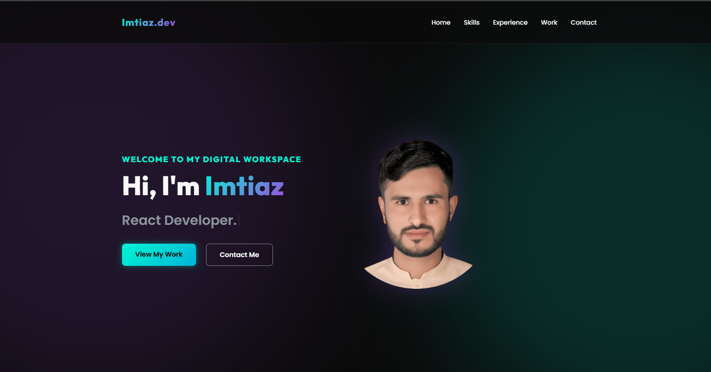
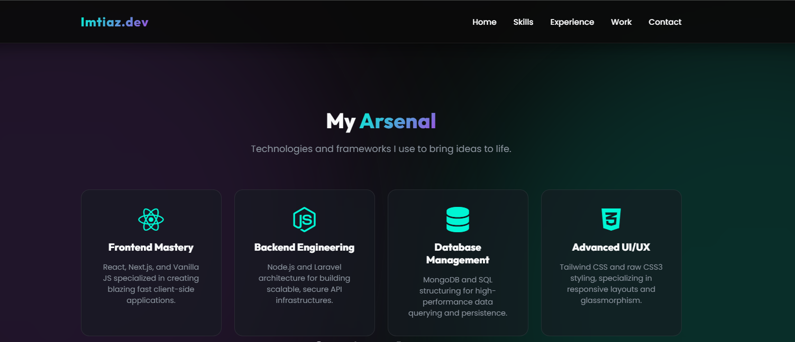
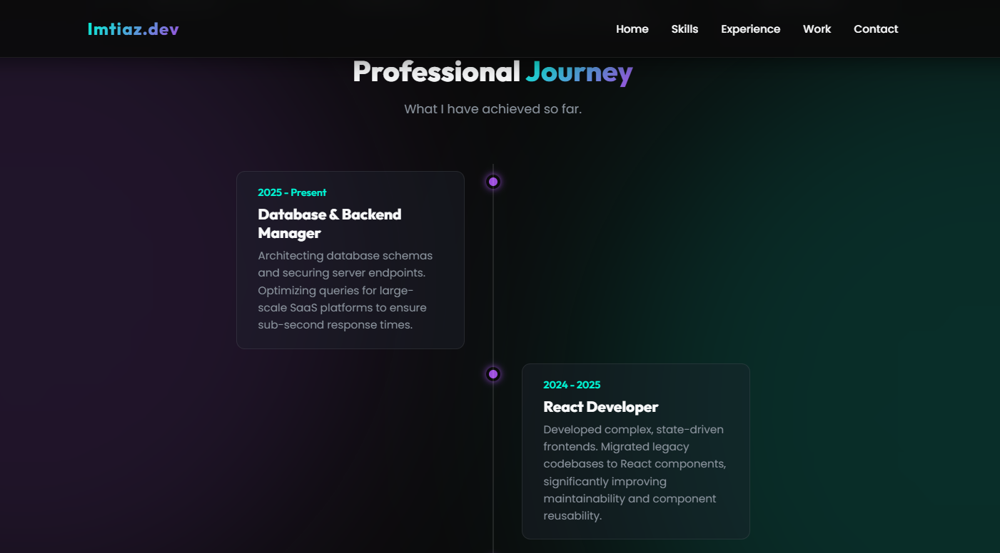
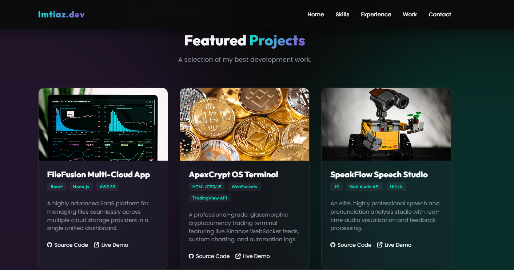
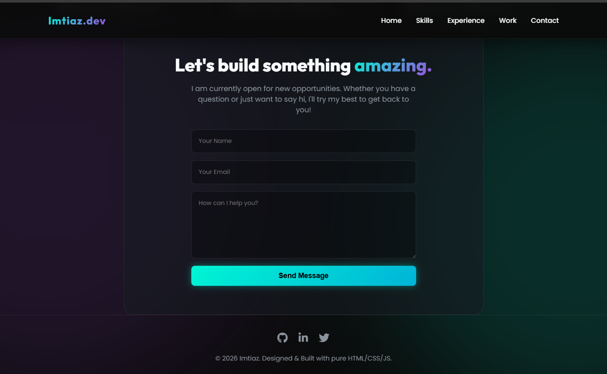

# Imtiaz.dev — Personal Developer Portfolio 🚀

A premium, fully animated personal portfolio website built entirely with **pure HTML5, CSS3, and Vanilla JavaScript**. Designed with a glassmorphic cyber-noir aesthetic, scroll-triggered animations, and a mobile-responsive layout to create a powerful first impression on recruiters, clients, and fellow developers.

---

## 🖥️ Live Preview

### Hero Section


A striking introduction featuring a dynamic **Typed.js** animation that cycles through professional roles (React Developer, Full Stack Engineer, Database Manager), dual call-to-action buttons with a glowing cyan gradient, and a profile portrait with a purple ambient glow effect.

---

## ✨ Features

### 🧩 Skills — Bento Grid Layout


A modern **Bento Box** grid showcasing core competencies across four domains — Frontend Mastery, Backend Engineering, Database Management, and Advanced UI/UX. Each card features glassmorphic styling with cyan border glow on hover.

---

### 📊 Experience — Interactive Vertical Timeline


A sleek vertical timeline that traces the professional journey from HTML/CSS Specialist through React Developer to Database & Backend Manager. Each entry fades in dynamically as the user scrolls, powered by the **IntersectionObserver API**.

---

### 🚀 Featured Projects — Showcase Grid


A responsive project gallery featuring top development work. Each card includes a cover image with a **zoom-on-hover** effect, technology tags (React, Node.js, WebSockets, etc.), project descriptions, and direct links to source code and live demos.

---

### 📬 Contact Form


A centered, glassmorphic contact form with glowing cyan focus states on inputs. Pre-wired with **Formspree** for real email delivery. Includes social links (GitHub, LinkedIn, Twitter) in the footer with lift-on-hover animations.

---

## 🛠️ Technology Stack

| Category | Technology |
|----------|-----------|
| **Structure** | HTML5 (Semantic Elements) |
| **Styling** | Vanilla CSS3 — CSS Grid, Flexbox, CSS Variables, Glassmorphism, Keyframe Animations |
| **Logic** | Vanilla JavaScript (ES6+) — IntersectionObserver, DOM Manipulation |
| **Typography** | Google Fonts (Outfit + Poppins) |
| **Icons** | FontAwesome 6 |
| **Animations** | Typed.js for hero text, custom CSS keyframes for ambient floating orbs |

## 📂 Project Structure

```text
Portfolio-Website/
├── image/              # Profile photo and tech logos
├── screenshots/        # README preview images
├── index.html          # Semantic HTML5 layout with 5 sections
├── style.css           # Complete design system with CSS variables and responsive breakpoints
├── script.js           # IntersectionObserver animations, Typed.js config, mobile menu logic
└── README.md           # Project documentation
```

## 🎨 Design Highlights

- **Ambient Background Orbs**: Two large blurred pseudo-elements float with a slow 20-second animation cycle, adding depth without impacting performance.
- **Glassmorphic Panels**: Cards and containers use `backdrop-filter: blur()` with semi-transparent backgrounds and subtle border highlights.
- **Scroll Animations**: Every section uses a `.hidden` → `.visible` class toggle via `IntersectionObserver`, creating smooth fade-and-slide entrance effects.
- **Sticky Navigation**: A frosted-glass header that darkens and gains a drop shadow as the user scrolls past 50px.
- **Color Palette**: Obsidian Dark (`#0A0A0A`), Neon Cyan (`#00F5D4`), Deep Purple (`#9D4EDD`).

## 🚀 Getting Started

1. Clone or download this repository.
2. Open `index.html` in any modern web browser.
3. *No build tools, servers, or installations required!*

## 📝 License

This project is open-source and available for educational and portfolio purposes.
